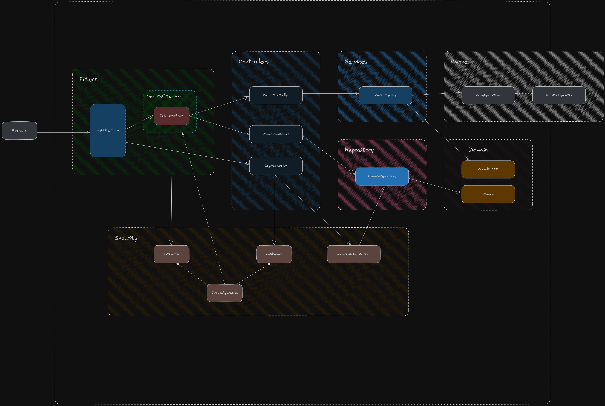

<h1>
    <a href="https://www.dio.me/">
     </a>
    <span>Aplicação que permite consulta de endereços</span>
</h1>

Desenvolvida utilizando o Framework Spring e Spring Boot. Possui módulos para autenticação, gerenciamento de usuários e consulta de CEPs através de consumo do serviço ViaCEP.

## Objetivo
Demonstrar habilidades de programação orientada a objetos na prática desenvolvendo uma aplicação real.

## Diagrama de arquitetura



<h3>
    <a href="https://www.dio.me/">
</a>
    <span>Deploy com Railway</span>
</h3>

```yaml
```